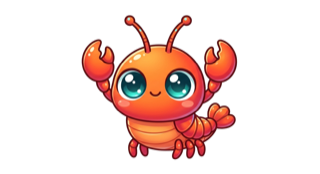

# 🦞 龙虾宝宝 Lobster Baby

<div align="center">



**一个可爱的桌面宠物，实时监控你的 OpenClaw 编程助手状态**

**A cute desktop pet that monitors your OpenClaw coding assistant in real-time**

[](https://github.com/abczsl520/lobster-baby/releases)
[](LICENSE)
[](https://github.com/abczsl520/lobster-baby)
[](https://github.com/abczsl520/lobster-baby/releases)

[中文](#-特性) | [English](#-features)

</div>

---

## ✨ 特性

- 🔏 **Apple 签名 + 公证** — 双击安装，零警告，Gatekeeper 直接放行
- 🎨 **10 级龙虾皮肤** — AI 生成，从粉色宝宝到龙虾之王
- 📊 **真实 API 用量** — 扫描 OpenClaw session 文件，精确统计
- 🌐 **龙虾社区** — 注册编号、排行榜、PK 对战
- 🏆 **成就系统** — Token 里程碑解锁（12 个成就）
- 📈 **趋势图表** — 每日 Token 趋势、均值线、峰值、周环比、CSV 导出
- 🖱️ **边缘吸附** — 拖到屏幕边缘自动停靠，专属停靠动画
- 🔥 **连击特效** — 快速点击触发旋转/弹跳/彩虹/跳舞，动画可叠加
- 🔔 **自动更新** — 检测新版本并提示
- 🧩 **插件系统** — 安装/开发插件扩展功能，权限沙箱 + 速率限制保护
- 🌍 **多语言** — 中文/English，自动检测系统语言
- 🎭 **桌面宠物动画** — 闲时微动画（歪头/摇摆/探头）、点击粒子、状态闪光
- 🎨 **主题系统** — 5 种配色方案（龙虾红/海洋蓝/森林绿/日落紫/尊贵金）
- 🔌 **SSH 远程管理** — 直连服务器查看状态、进程管理、日志查看
- ⚡ **实时速率** — Token 消耗速率 + 预计升级时间
- 💾 **数据备份** — 一键备份/恢复所有设置和数据
- 👁️ **自动透明** — 闲置后自动半透明，可调节透明度

## ✨ Features

- 🔏 **Apple Signed & Notarized** — Double-click to install, no warnings, Gatekeeper approved
- 🎨 **10-Level Skins** — AI-generated, from pink baby to Lobster King
- 📊 **Real API Usage** — Scans OpenClaw session files for accurate stats
- 🌐 **Lobster Community** — Registration, leaderboards, PK battles
- 🏆 **Achievements** — Token milestone unlocks (12 milestones)
- 📈 **Trend Charts** — Daily trends, avg line, peak day, WoW comparison, CSV export
- 🖱️ **Edge Docking** — Drag to screen edge, auto-dock with custom animations
- 🔥 **Combo Effects** — Rapid clicks trigger spin/bounce/rainbow/dance, stackable animations
- 🔔 **Auto Update** — Detects new versions and prompts
- 🧩 **Plugin System** — Install/develop plugins with sandboxed permissions + rate limiting
- 🌍 **i18n** — Chinese/English, auto-detects system language
- 🎭 **Pet Animations** — Idle micro-animations, click sparkles, status flash
- 🎨 **Theme System** — 5 color themes (Lobster Red/Ocean Blue/Forest Green/Sunset Purple/Golden Luxe)
- 🔌 **SSH Remote** — Direct server connection for status, process management, log viewing
- ⚡ **Real-time Rate** — Token consumption rate + estimated time to next level
- 💾 **Data Backup** — One-click backup/restore all settings and data
- 👁️ **Auto Transparency** — Auto-fade when idle, adjustable opacity

## 📦 下载安装 / Download

### 🖥️ 终端一键安装 / Terminal Install (Mac)

```bash
curl -fsSL https://raw.githubusercontent.com/abczsl520/lobster-baby/main/install.sh | bash
```

### 📥 手动下载 / Manual Download

前往 [Releases](https://github.com/abczsl520/lobster-baby/releases/latest) 下载：

**Mac (已签名+公证 / Signed & Notarized):**
- `arm64.dmg` — Apple Silicon (M1/M2/M3/M4)
- `x64.dmg` — Intel Mac

**Windows:**
- `win-x64-setup.exe` — 安装版 / Installer (recommended)
- `win-x64-portable.exe` — 免安装版 / Portable

> Mac 版已通过 Apple Developer ID 签名和公证，双击 DMG 直接安装，不会弹出"已损坏"或"无法验证开发者"警告。
>
> Mac builds are signed with Apple Developer ID and notarized. Just double-click the DMG — no security warnings.

### ⚠️ Windows SmartScreen 提示？

首次运行点击「更多信息」→「仍要运行」/ Click "More info" → "Run anyway"

## 🚀 使用 / Usage

1. **启动** — 双击打开，龙虾出现在屏幕角落 / Launch and lobster appears on screen
2. **拖动** — 鼠标拖动到任意位置 / Drag to any position
3. **双击** — 打开状态面板 / Double-click to open status panel
4. **右键** — 快捷菜单 / Right-click for menu (community, trends, achievements, plugins)
5. **边缘停靠** — 拖到屏幕边缘自动挂靠 / Drag to edge for auto-docking
6. **连击** — 快速点击龙虾触发特效 / Rapid clicks trigger combo effects

### 🔥 连击系统 / Combo System

| 连击/Combo | 效果/Effect |
|-----------|------------|
| ×3 | 🌀 360° 旋转 / Spin |
| ×5 | ⭐ 弹跳 + 星爆 / Bounce + Star burst |
| ×7 | 🌈 彩虹 + 屏幕闪光 / Rainbow + Screen flash |
| ×10 | 💃 跳舞 3 秒 / Dance for 3s |

1 秒内连续点击触发，×20 自动循环。动画可叠加（嵌套 shell 架构）。

Trigger within 1 second, loops at ×20. Animations are stackable (nested shell architecture).

## 🌐 龙虾社区 / Community

- **注册** — 给龙虾起名，获得专属编号（LB-000001）/ Name your lobster, get a unique ID
- **排行榜** — Token / 等级 / 连续在线 / 成就 四种排行 / 4 leaderboard types
- **PK 对战** — 生成 6 位 PK 码，和朋友比拼 / Generate PK code, battle friends (100-point system)
- **隐私保护** — 仅收集昵称和游戏数据 / Only collects nickname and game data

## 🧩 插件系统 / Plugin System

- **安装** — 右键龙虾 → 🧩 插件 → 导入链接或 zip / Right-click → Plugins → Import URL or zip
- **插件库** — [lbhub.ai](https://lbhub.ai) 浏览和发布插件 / Browse & publish at [lbhub.ai](https://lbhub.ai)
- **开发** — 只需 `manifest.json` + `index.js`，详见 [API 文档](https://lbhub.ai/#api-docs)

```js
// manifest.json
{
  "id": "my-plugin",
  "name": "My Plugin",
  "version": "1.0.0",
  "entry": "index.js",
  "permissions": ["notification"]
}

// index.js
module.exports = {
  activate(lobster) {
    lobster.menu.add({
      label: '🎉 Hello',
      onClick: () => lobster.ui.toast('Hello from plugin!')
    });
  },
  deactivate() {}
};
```

**安全机制 / Security:** 权限声明 + 用户确认、Shell 命令黑名单、30s 超时、路径穿越防护、私有 IP 屏蔽

## 🎮 等级系统 / Level System

| 等级/Level | Token | 皮肤/Skin |
|------|-----------|------|
| Lv.1 | 0 | 粉色小宝宝 Pink Baby 🍼 |
| Lv.2 | 50M | 活泼小龙虾 Lively Lobster |
| Lv.3 | 200M | 戴皇冠 Crown 👑 |
| Lv.4 | 500M | 肌肉猛男 Muscle 💪 |
| Lv.5 | 1B | 金冠金链 Gold Chain ✨ |
| Lv.6 | 2.5B | 银甲骑士 Silver Knight 🛡️ |
| Lv.7 | 5B | 紫色魔法师 Purple Mage 🧙 |
| Lv.8 | 10B | 金甲将军 Gold General ⚔️ |
| Lv.9 | 25B | 彩虹龙虾 Rainbow 🌈 |
| Lv.10 | 50B | 龙虾之王 Lobster King 👑 |

## 🛠️ 从源码构建 / Build from Source

```bash
git clone https://github.com/abczsl520/lobster-baby.git
cd lobster-baby
npm install
npm run dev          # Dev mode
npm run build        # Build
npx electron-builder --mac --arm64  # Package Mac (auto signs + notarizes if cert installed)
npx electron-builder --win --x64    # Package Windows
```

## 📄 许可证 / License

MIT License

---

<div align="center">

**觉得有趣？给个 ⭐️ Star 吧！/ Like it? Give a ⭐️ Star!**

Made with ❤️ and 🦞

</div>
